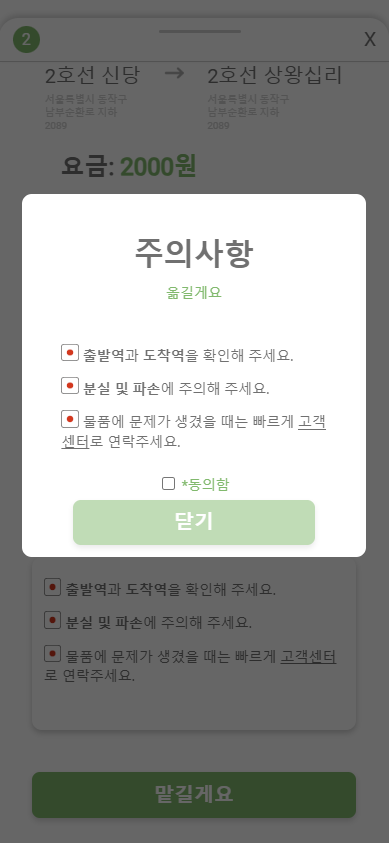

# POSTROFIT

<div align="center">
  
</div>

<br/>

POSTROFIT은 **'지하철 보관함을 어떻게하면 잘 사용할 수 있을까?'** 라는 물음으로 시작한 프로젝트 입니다.

비어있는 지하철 보관함을 이용해 물건 보관뿐만 아니라 다른 역에 있는 지하철 보관함을 통해 택배 서비스를 이용할 수 있는 플랫폼입니다. 지하철 이용객이 물건을 맡기고, 다른 이용객이 물건을 옮겨주며 수익을 얻어가며 소소한 즐거움을 얻을 수 있습니다.

제공하는 **POSTROFIT의 주요 기능**은 다음과 같습니다.

1. 보관할게요: 물건 보관
2. 맡길게요: 택배 맡기기 서비스
3. 옮길게요: 택배 옮기기 서비스

## About

### 관련 주소

**배포주소**

- 프론트엔드: http://3.16.112.53:8080
- 백엔드: http://18.183.199.196:8000/backend-service/

**깃주소**

- 백엔드: https://github.com/RDDcat/postrofit

### 개발팀 소개

#### 프론트엔드

| 김성준 | 김태영 |
| --- | --- |
| ???@gmail.com | kimty131@gmail.com |
| [@kim-song-jun](https://github.com/kim-song-jun) | [@nulzi](https://github.com/nulzi) |

#### 백엔드

| 육마로 | 정의현 |
| --- | --- |
| ???@gmail.com | ???@gmail.com |
| [@RDDcat](https://github.com/RDDcat) | [@Euihyunee](https://github.com/Euihyunee) |

## 시작 가이드

### 실행 환경

- Node.js 16.16.0
- Npm 8.3.0

### 설치 및 실행

```bash
$ npm install

$ npm run serve
```

## 기술 스택

### Environment

<div>


</div>

### Config

<div>

</div>

### Development

<div>


</div>

### Communication

<div>


</div>

### Deploy

<div>


</div>

## 화면 및 기능

### 로딩 및 로그인 화면

| 로딩 화면 | 로그인 화면 |
| --- | --- |
|  |  |

첫 접속에 **로딩 화면**이 존재한다. **로그인 화면**을 통해 임시로 설정해놓은 사용자로 접속할 수 있다.

### 메인 화면

| 메인 화면 | 설명 |
| --- | --- |
|  | **메인 화면**에서 제공하는 기능은 다음과 같다.<br>- 내정보 화면으로 이동<br>- 역 선택 또는 역 검색<br>- 화면 확대/축소<br>- 출발역과 도착역 서로 바꾸기 |

### 보관할게요 화면

| 메인 화면 | 설명 |
| --- | --- |
|  | **보관할게요**는 다음 순서로 진행된다.<br>- 메인 화면에서 역 선택<br>- 원하는 보관함 선택<br>- 가격 및 주의사항 확인<br>- 결제 후 물건 보관 |

| 보관함 선택 전 | 보관함 선택 후 | 기본 요금 정보 | 주의사항 동의 전 |
| --- | --- | --- | --- |
|  |  |  |  |

| 주의사항 동의 후 | 결제 완료 | 보관함 비밀번호 |
| --- | --- | --- |
|  |  |  |

### 맡길게요 화면

| 메인 화면 | 설명 |
| --- | --- |
|  | **맡길게요**는 다음 순서로 진행된다.<br>- 메인 화면에서 출발역, 도착역 선택<br>- 원하는 보관함 사이즈 선택<br>- 원하는 보관함 선택<br>- 가격 및 주의사항 확인<br>- 결제 후 물건 맡기기 |

| 보관함 사이즈 선택 | 보관함 선택 전 | 보관함 선택 후 | 기본 요금 정보 |
| --- | --- | --- | --- |
|  |  |  |  |

| 주의사항 동의 전 | 주의사항 동의 후 | 결제 완료 | 보관함 비밀번호 |
| --- | --- | --- | --- |
|  |  |  |  |

### 옮길게요 화면

| 옮길게요 화면 | 설명 |
| --- | --- |
|  | **옮길게요**는 다음 순서로 진행된다.<br>- 메인 화면에서 출발역, 도착역 선택<br>- 옮길 보관함 배정 받기<br>- 수익 및 주의사항 확인<br>- 물건 옮기기 |

| 보관함 선택 전 | 보관함 선택 후 | 기본 요금 정보 | 주의사항 동의 전 |
| --- | --- | --- | --- |
|  |  |  |  |

| 보관함 선택 전 | 보관함 선택 후 |
| --- | --- |
|  |  |

### 내정보 화면

| 내정보 화면 | 설명 |
| --- | --- |
|  | **내정보 화면**에서 제공하는 기능은 다음과 같다.<br>- 이용중인 보관함 정보<br>- 이용내역<br>- 이용중인 택배 서비스 확인<br>- 이용내역 필터링 |

| 이용중인 보관함 | 보관함 비밀번호 | 설명 |
| --- | --- | --- |
|  |  | 현재 이용중인 보관함의 정보를 보여주는 화면이다.<br>보관함의 위치를 확인할 수 있으며,<br>보관함의 비밀번호도 확인 가능하다. |

| 과거 이용내역 | 설명 | 현재 이용내역 | 설명 |
| --- | --- | --- | --- |
|  | 과거의 이용했던 내역이다. |  | 현재 이용중인 택배 서비스를 확인할 수 있다. |
